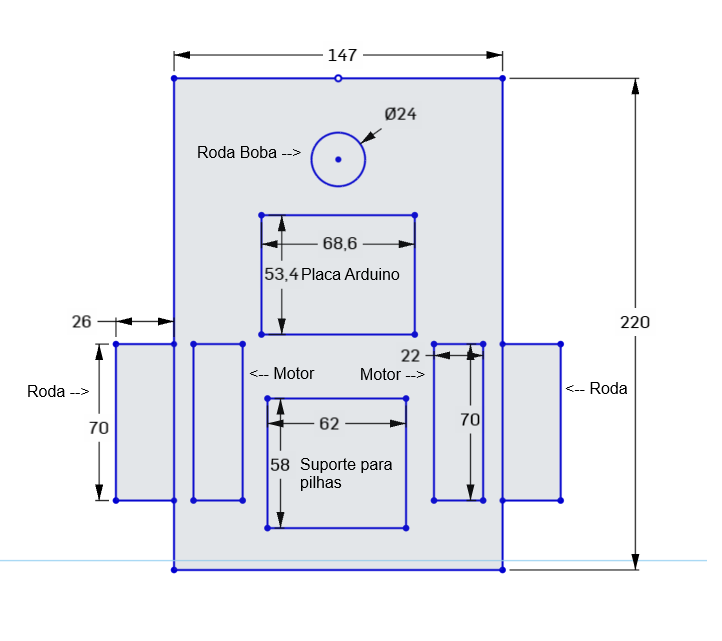

# 🤖 Robô Carrinho 2WD

Projeto de desenvolvimento e documentação de um **robô móvel com chassi 2WD**, utilizando uma estrutura em acrílico, dois motores DC e duas rodas motrizes.

## 👥 Integrantes

- **Gabriel Riquetto Reis** — RM 98685
- **Leticia Cristina Gandarez Resina** — RM 98069

---

## 📋 1. Ficha de Requisitos

### 1.1 Estrutura do Chassi

| Característica               | Especificação               |
| ---------------------------- | --------------------------- |
| Tipo                         | Chassi para robô móvel 2WD  |
| Material                     | Acrílico                    |
| Cor                          | Transparente                |
| Comprimento                  | Aproximadamente **21,2 cm** |
| Largura                      | Aproximadamente **15,2 cm** |
| Peso                         | Aproximadamente **100 g**   |
| Quantidade de rodas motrizes | 2                           |
| Roda de apoio                | 1 roda boba universal       |
| Chave Liga/Desliga           | Sim                         |

---

### 1.2 Motores

| Característica               | Especificação                                 |
| ---------------------------- | --------------------------------------------- |
| Quantidade                   | **2 motores DC**                              |
| Tipo                         | Motor DC com caixa de redução                 |
| Tensão de operação           | **3 V a 6 V DC**                              |
| Disposição                   | Um motor em cada lateral do chassi            |
| Acoplamento                  | Cada motor é conectado diretamente a uma roda |
| Quantidade de discos encoder | 2                                             |

Os dois motores permitem a movimentação independente das rodas, possibilitando o deslocamento para frente, para trás e a realização de curvas por meio da diferença de acionamento entre os motores.

---

### 1.3 Alimentação

| Característica          | Especificação                |
| ----------------------- | ---------------------------- |
| Suporte de alimentação  | Suporte para **4 pilhas AA** |
| Quantidade de pilhas    | 4                            |
| Chave de alimentação    | Liga/Desliga                 |
| Alimentação dos motores | 3 V a 6 V DC                 |

---

### 1.4 Placa Controladora

A placa controladora **não acompanha o kit do chassi** e será definida de acordo com os requisitos eletrônicos e de programação do projeto.

O chassi possui compatibilidade física para utilização com diferentes plataformas de desenvolvimento, como:

- Arduino;
- ESP32;
- ESP8266;
- Raspberry Pi;
- Outros microcontroladores e módulos eletrônicos compatíveis.

> **Placa controladora definida para o projeto:** _A definir._

---

### 1.5 Posição dos Componentes

A distribuição inicial dos principais componentes no chassi é:

| Componente                    | Posição                                                 |
| ----------------------------- | ------------------------------------------------------- |
| Motor DC esquerdo             | Lateral esquerda do chassi                              |
| Motor DC direito              | Lateral direita do chassi                               |
| Rodas motrizes                | Acopladas aos motores nas laterais                      |
| Roda boba universal           | Região frontal do chassi                                |
| Suporte para pilhas           | Região central/superior do chassi                       |
| Chave Liga/Desliga            | Região central do chassi                                |
| Placa controladora            | Posição a ser definida durante a montagem               |
| Sensores e módulos adicionais | Posições a serem definidas conforme evolução do projeto |

A posição da placa controladora e dos demais componentes eletrônicos poderá ser ajustada durante o desenvolvimento para garantir melhor distribuição de peso, organização dos cabos e acesso aos componentes.

---

### 1.6 Componentes Disponíveis no Kit

| Quantidade | Componente                              |
| ---------: | --------------------------------------- |
|          1 | Chassi em acrílico                      |
|          2 | Motores DC 3 V–6 V com caixa de redução |
|          2 | Rodas de borracha                       |
|          1 | Roda boba universal                     |
|          1 | Chave Liga/Desliga                      |
|          2 | Discos encoder                          |
|          1 | Suporte para 4 pilhas AA                |
|          1 | Kit de parafusos e espaçadores          |

---

## ✏️ 2. Croqui do Chassi

O croqui deverá apresentar a disposição dos principais componentes do robô, incluindo motores, rodas, roda boba, alimentação, placa controladora e demais componentes utilizados no projeto.

---

## 🔧 3. Desenvolvimento do Projeto

Esta documentação será atualizada durante o desenvolvimento do robô, registrando alterações na estrutura, componentes eletrônicos utilizados, esquema de montagem, programação e testes realizados.

### Status inicial

- [x] Definição do chassi
- [x] Levantamento das dimensões
- [x] Identificação dos motores
- [x] Identificação dos componentes do kit
- [ ] Definição da placa controladora
- [ ] Elaboração do croqui
- [ ] Montagem do chassi
- [ ] Integração dos componentes eletrônicos
- [ ] Desenvolvimento do software
- [ ] Testes de movimentação
