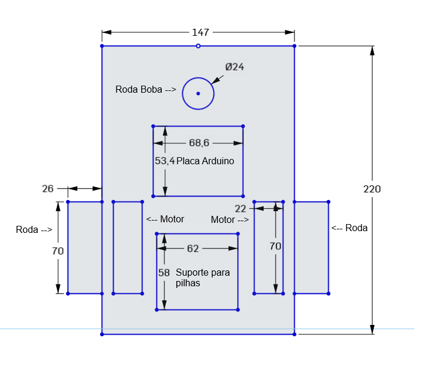
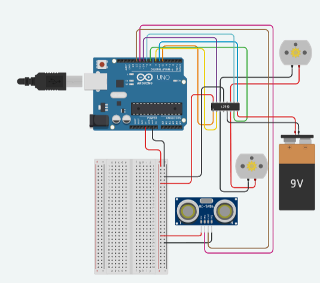
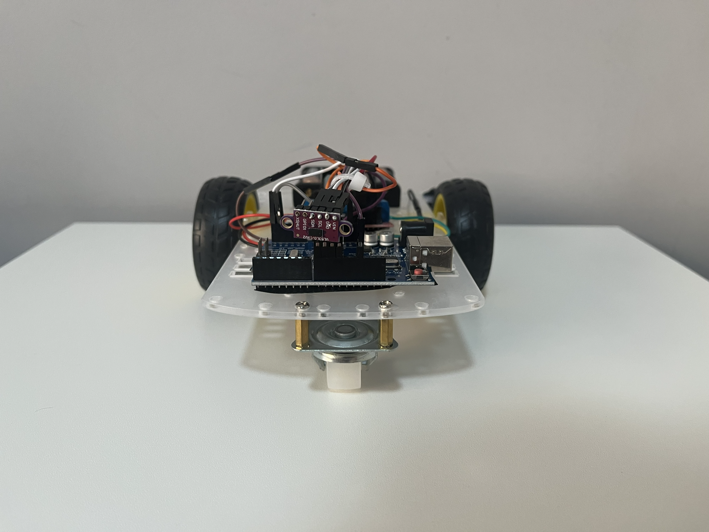
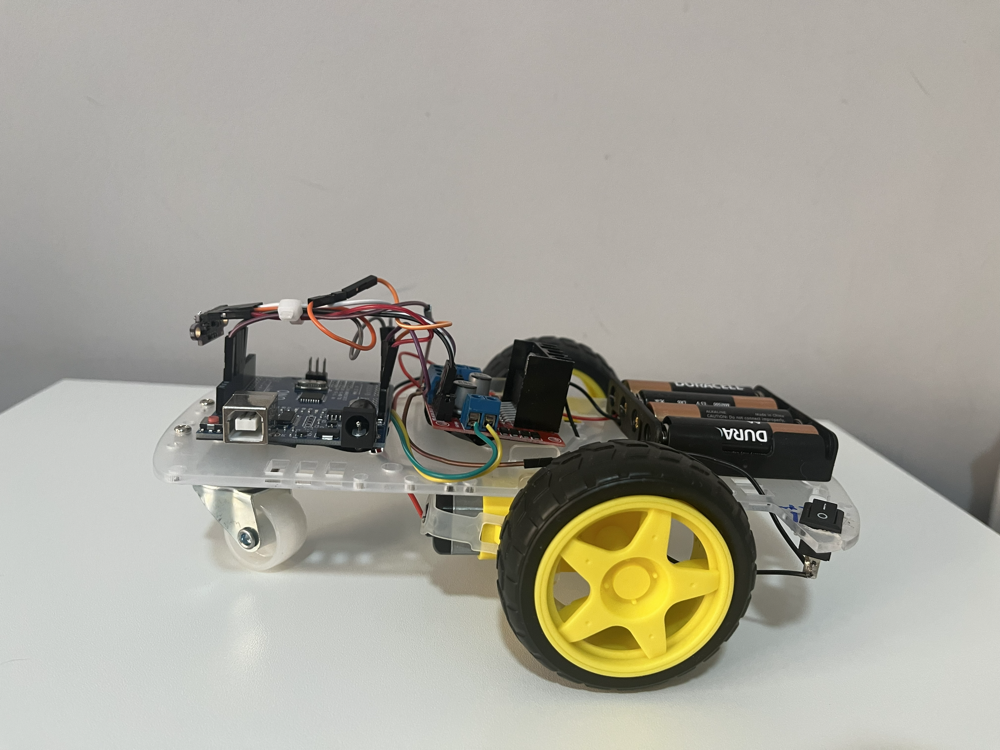
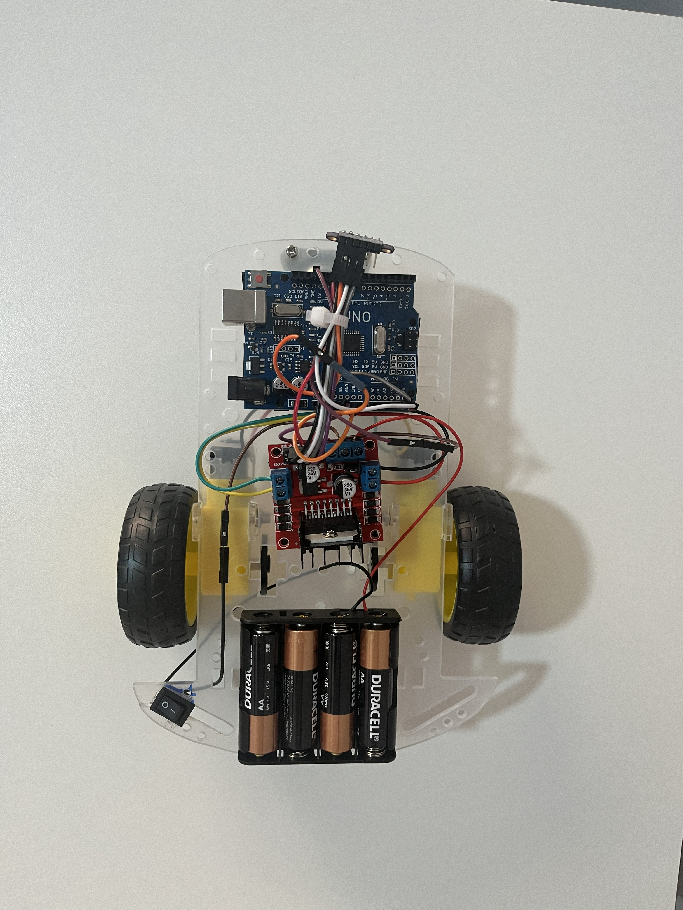

# 🤖 Robô Carrinho 2WD

Projeto desenvolvido para a disciplina **Project-Based Maker Lab**, com o objetivo de projetar, montar e programar um **robô móvel autônomo com chassi 2WD**, capaz de se locomover e detectar obstáculos presentes em sua trajetória.

O sistema utiliza uma estrutura em acrílico, dois motores DC, uma placa compatível com Arduino Uno R3, uma Ponte H L298N e um sensor de distância VL53L0X ToF.

---

## 👥 Integrantes

* **Gabriel Riquetto Reis** — RM 98685
* **Leticia Cristina Gandarez Resina** — RM 98069
* **Sabrina Flores Morais** — RM 550781
* **Bianca Carvalho Dancs Firsoff** — RM 551645

---

# 📌 Checkpoint 01

## 🎯 1. Sobre o Projeto

### 1.1 O que é o projeto?

O projeto consiste no desenvolvimento de um **robô móvel autônomo 2WD (Two-Wheel Drive)**.

O robô possui duas rodas motrizes acionadas independentemente por motores DC e uma roda boba universal utilizada como apoio.

Uma placa compatível com **Arduino Uno R3** será responsável pelo processamento das informações do sistema, enquanto uma **Ponte H L298N** realizará o controle dos motores.

Para detectar obstáculos à sua frente, o robô utilizará um sensor de distância **VL53L0X ToF (Time-of-Flight)**.

---

### 1.2 Objetivo

O objetivo principal é desenvolver um robô capaz de:

* deslocar-se para frente e para trás;
* realizar curvas através do controle independente dos motores;
* detectar obstáculos presentes em sua trajetória;
* processar as informações recebidas pelo sensor;
* alterar sua movimentação de acordo com as informações detectadas.

Durante o desenvolvimento serão realizados testes de montagem, alimentação, controle dos motores, leitura do sensor e lógica de movimentação.

---

### 1.3 Funcionalidades previstas

As principais funcionalidades previstas são:

* Controle independente de dois motores DC;
* Movimentação para frente;
* Movimentação para trás;
* Realização de curvas;
* Controle de velocidade dos motores;
* Medição de distância;
* Detecção de obstáculos;
* Processamento das informações pelo Arduino;
* Tomada de decisão de movimentação com base na distância detectada.

---

# 📋 2. Ficha de Requisitos

## 2.1 Estrutura do Chassi

| Característica | Especificação |
| --- | --- |
| Tipo | Chassi para robô móvel 2WD |
| Material | Acrílico |
| Cor | Transparente |
| Comprimento | Aproximadamente **22 cm** |
| Largura | Aproximadamente **14,7 cm** |
| Peso | Aproximadamente **100 g** |
| Quantidade de rodas motrizes | 2 |
| Roda de apoio | 1 roda boba universal |
| Chave Liga/Desliga | Sim |

---

## 2.2 Motores

| Característica | Especificação |
| --- | --- |
| Quantidade | **2 motores DC** |
| Tipo | Motor DC com caixa de redução |
| Tensão de operação | **3 V a 6 V DC** |
| Disposição | Um motor em cada lateral do chassi |
| Acoplamento | Cada motor é conectado diretamente a uma roda |
| Quantidade de discos encoder | 2 |

Os dois motores permitem a movimentação independente das rodas, possibilitando o deslocamento para frente, para trás e a realização de curvas por meio da diferença de acionamento entre os motores.

---

## 2.3 Alimentação

| Característica | Especificação |
| --- | --- |
| Suporte de alimentação | Suporte para **4 pilhas AA** |
| Quantidade de pilhas | 4 |
| Dimensões previstas do suporte | Aproximadamente **62 × 58 mm** |
| Chave de alimentação | Liga/Desliga |
| Alimentação dos motores | **3 V a 6 V DC** |

O suporte para pilhas acompanha o kit do chassi e foi considerado como a fonte de alimentação do sistema de movimentação do robô.

---

## 2.4 Placa Controladora

A placa controladora selecionada para o projeto é uma **placa compatível com Arduino Uno R3**, baseada no microcontrolador **ATmega328P**.

| Característica | Especificação |
| --- | --- |
| Placa | Arduino Uno R3 compatível |
| Microcontrolador | ATmega328P |
| Tensão de operação | 5 V |
| Frequência de clock | 16 MHz |
| Memória Flash | 32 KB |
| SRAM | 2 KB |
| EEPROM | 1 KB |
| Entradas analógicas | 6 |
| Pinos digitais de entrada/saída | 14 |
| Pinos PWM | 6 |
| Dimensões | Aproximadamente **68,3 × 53 × 10 mm** |
| Peso | Aproximadamente **25 g** |

A placa será responsável pelo processamento das informações recebidas pelo sensor e pelo envio dos sinais de controle para os motores através da Ponte H.

---

## 2.5 Ponte H

Para o controle dos motores será utilizado o módulo **Ponte H L298N**.

A Ponte H funciona como interface entre o Arduino e os motores DC, permitindo controlar independentemente o sentido de rotação e a velocidade dos dois motores.

| Característica | Especificação |
| --- | --- |
| Modelo | L298N |
| Chip | ST L298N |
| Quantidade de motores suportados | 2 motores DC |
| Tensão de operação | 4 V a 35 V |
| Tensão lógica | 5 V |
| Corrente máxima | Até 2 A por canal |
| Potência máxima informada | 25 W |
| Dimensões | Aproximadamente **43 × 43 × 27 mm** |
| Peso | Aproximadamente **30 g** |

---

## 2.6 Sensor

Para a detecção de obstáculos será utilizado o sensor de distância **VL53L0X ToF (Time-of-Flight)**.

Esse sensor utiliza tecnologia Time-of-Flight para medir a distância entre o robô e objetos à sua frente, enviando as informações ao Arduino através do protocolo **I²C**.

| Característica | Especificação |
| --- | --- |
| Sensor | VL53L0X |
| Tecnologia | Time-of-Flight (ToF) |
| Função | Medição de distância e detecção de obstáculos |
| Alcance informado | Até aproximadamente **2 metros** |
| Comunicação | I²C |
| Tensão de alimentação | **3,3 V a 5 V** |
| Consumo informado | Aproximadamente **10 mA** |
| Comprimento | Aproximadamente **25 mm** |
| Largura | Aproximadamente **13 mm** |
| Altura | Aproximadamente **5 mm** |
| Posição prevista | Região frontal do chassi |

> **Observação:** As dimensões do módulo VL53L0X são aproximadas e podem variar de acordo com o fabricante e a placa breakout utilizada.

---

## 2.7 Atuadores

Os principais atuadores do projeto são os **dois motores DC** responsáveis pela movimentação das rodas.

| Atuador | Quantidade | Função |
| --- | ---: | --- |
| Motor DC com caixa de redução | 2 | Movimentação independente das rodas |
| Roda motriz | 2 | Transmissão do movimento dos motores ao solo |

O controle dos motores será realizado através da Ponte H, permitindo determinar o sentido de rotação e controlar a movimentação do robô.

---

## 2.8 Posição dos Componentes

A distribuição inicial dos principais componentes no chassi será:

| Componente | Posição |
| --- | --- |
| Motor DC esquerdo | Lateral esquerda do chassi |
| Motor DC direito | Lateral direita do chassi |
| Rodas motrizes | Acopladas aos motores nas laterais |
| Roda boba universal | Região frontal do chassi |
| Suporte para pilhas | Região central/inferior do chassi |
| Chave Liga/Desliga | Região central do chassi |
| Arduino Uno R3 | Região central/superior do chassi |
| Ponte H L298N | Região central do chassi, próxima aos motores |
| Sensor VL53L0X ToF | Região frontal do chassi, direcionado para a trajetória do robô |

A posição dos componentes poderá ser ajustada durante a montagem para garantir melhor distribuição de peso, organização dos cabos, acesso aos componentes e funcionamento adequado do sistema.

---

# 📏 3. Tabela Dimensional dos Componentes

| Componente | Comprimento | Largura | Altura | Forma de fixação |
| --- | ---: | ---: | ---: | --- |
| Motor esquerdo | 70 mm | 22 mm | Conforme componente do kit | Fixação lateral no chassi utilizando suporte e parafusos |
| Motor direito | 70 mm | 22 mm | Conforme componente do kit | Fixação lateral no chassi utilizando suporte e parafusos |
| Arduino Uno R3 | **68,3 mm** | **53 mm** | **10 mm** | Fixação com parafusos e espaçadores |
| Ponte H L298N | **43 mm** | **43 mm** | **27 mm** | Fixação utilizando os furos do módulo, parafusos e espaçadores |
| Suporte para 4 pilhas AA | **62 mm** | **58 mm** | Conforme suporte do kit | Fixação na região central/inferior do chassi |
| Sensor VL53L0X ToF | **~25 mm** | **~13 mm** | **~5 mm** | Fixação na região frontal do chassi |

> **Observação:** Algumas dimensões são aproximadas e poderão ser atualizadas após a medição física dos componentes durante a montagem.

---

# 🧩 4. Componentes do Projeto

## 4.1 Componentes disponíveis no Kit

| Quantidade | Componente |
| ---: | --- |
| 1 | Chassi em acrílico |
| 2 | Motores DC 3 V–6 V com caixa de redução |
| 2 | Rodas de borracha |
| 1 | Roda boba universal |
| 1 | Chave Liga/Desliga |
| 2 | Discos encoder |
| 1 | Suporte para 4 pilhas AA |
| 1 | Kit de parafusos e espaçadores |

---

## 4.2 Componentes adicionais

Além dos componentes fornecidos no kit do chassi, serão utilizados:

| Quantidade | Componente |
| ---: | --- |
| 1 | Arduino Uno R3 compatível |
| 1 | Ponte H L298N |
| 1 | Sensor VL53L0X ToF |
| Conforme necessidade | Cabos jumper para conexões elétricas |
| 4 | Pilhas AA |

---

# ✏️ 5. Croqui do Chassi

O croqui apresenta a disposição inicial dos principais componentes do robô, incluindo motores, rodas, roda boba, alimentação e placa controladora.

## 5.1 Visualização do Croqui



## 5.2 Arquivo CAD

O croqui do chassi também está disponível em formato **DXF (Drawing Exchange Format)**, permitindo sua abertura e edição em softwares CAD compatíveis.

📐 [**Acessar arquivo CAD do chassi — Chassi - Sketch 1.dxf**](./Chassi%20-%20Sketch%201.dxf)

> O arquivo `.dxf` corresponde ao arquivo CAD do chassi, enquanto a imagem `.png` permite a visualização direta do croqui pelo GitHub.

> A disposição dos componentes representa o planejamento inicial da montagem e poderá ser ajustada durante a construção física do protótipo.

---

# ⚙️ 6. Arquitetura do Sistema

A arquitetura básica do sistema é composta pela leitura do sensor pelo Arduino e pelo controle dos motores através da Ponte H.

```text
Sensor VL53L0X
      │
      │ I²C
      ▼
Arduino Uno R3
      │
      │ Sinais de controle
      ▼
Ponte H L298N
   │        │
   ▼        ▼
Motor      Motor
Esquerdo   Direito
   │        │
   ▼        ▼
 Roda      Roda
```

O sensor detectará obstáculos presentes na trajetória do robô. O Arduino processará as informações recebidas e enviará comandos para a Ponte H, responsável por controlar os dois motores DC.

---

# 🔌 7. Diagrama de Blocos e Conexões

Para validar previamente a arquitetura eletrônica do projeto, foi desenvolvido um **diagrama de conexões no Tinkercad**.

> **Importante:** devido à indisponibilidade de alguns dos componentes escolhidos para o projeto físico na biblioteca do Tinkercad, foram utilizadas substituições equivalentes apenas para a simulação:
>
> * **L298N → L293D**
> * **VL53L0X → HC-SR04**
>
> Essas substituições são utilizadas somente na representação/simulação do circuito. O projeto físico prevê a utilização da **Ponte H L298N** e do **sensor VL53L0X ToF**.

## 7.1 Diagrama desenvolvido no Tinkercad



### 🔗 Projeto no Tinkercad

O circuito também pode ser consultado diretamente no projeto desenvolvido pela equipe:

[Tinkercad — Diagrama do Robô 2WD](https://www.tinkercad.com/things/0Os1iEmq5E9/editel?returnTo=%2Fdashboard&sharecode=Maeo14KhVNHqeQg3-E-sCUGLrfLsDMqH7jZ2N4IQqK4)

---

## 7.2 Conexões utilizadas na simulação

### Arduino → L293D

| Pino Arduino | Conexão L293D | Função |
| --- | --- | --- |
| D5 | Ativar 1 e 2 | Habilitação/controle |
| D7 | Entrada 1 | Controle do motor |
| D8 | Entrada 2 | Controle do motor |
| D6 | Ativar 3 e 4 | Habilitação/controle |
| D9 | Entrada 3 | Controle do motor |
| D10 | Entrada 4 | Controle do motor |

### L293D → Motor 1

| L293D | Motor 1 |
| --- | --- |
| Saída 3 | Terminal 1 |
| Saída 4 | Terminal 2 |

### L293D → Motor 2

| L293D | Motor 2 |
| --- | --- |
| Saída 1 | Terminal 1 |
| Saída 2 | Terminal 2 |

### HC-SR04 → Arduino

| HC-SR04 | Arduino |
| --- | --- |
| TRIG | D11 |
| ECHO | D12 |

Os demais pontos de alimentação representados no circuito estão conectados ao **GND** ou **5 V**, conforme necessário.

---

## 7.3 Relação entre a Simulação e o Projeto Físico

A simulação foi utilizada para representar e validar a lógica geral das conexões eletrônicas.

| Função | Simulação no Tinkercad | Projeto físico |
| --- | --- | --- |
| Microcontrolador | Arduino Uno | Arduino Uno R3 compatível |
| Controle dos motores | L293D | L298N |
| Sensor de distância | HC-SR04 | VL53L0X ToF |
| Atuadores | 2 motores DC | 2 motores DC |

Dessa forma, a arquitetura funcional permanece equivalente: o sensor fornece informações de distância ao Arduino, que processa os dados e controla os motores através de uma Ponte H.

---

# 🔋 8. Diagrama de Alimentação

Para o projeto físico, foi considerado o uso de um **suporte para 4 pilhas AA**, componente fornecido junto ao kit do chassi.

A alimentação é responsável principalmente por fornecer energia ao sistema de movimentação, composto pelos motores DC e pela Ponte H.

```text
        ┌───────────────────┐
        │    4 Pilhas AA    │
        │ Suporte do Chassi │
        └─────────┬─────────┘
                  │
                  ▼
          ┌───────────────┐
          │ Chave ON/OFF  │
          └───────┬───────┘
                  │
                  ▼
           ┌─────────────┐
           │ Ponte H     │
           │    L298N    │
           └──────┬──────┘
                  │
             ┌────┴────┐
             ▼         ▼
          Motor 1   Motor 2
```

### Alimentação prevista

| Elemento | Especificação |
| --- | --- |
| Fonte considerada | 4 pilhas AA |
| Suporte | Suporte para 4 pilhas |
| Motores | 3 V a 6 V DC |
| Arduino | 5 V |
| Ponte H | L298N |
| Sensor | VL53L0X — 3,3 V a 5 V |
| Controle de alimentação | Chave Liga/Desliga |

> A configuração final da alimentação e das conexões elétricas poderá ser ajustada durante a montagem e os testes físicos do protótipo.

---

# 🖥️ 9. Simulação no Tinkercad

Antes da montagem física, foi elaborado um circuito no **Tinkercad** para representar a integração entre o Arduino, o controle dos motores, o sensor de distância e a alimentação.

Como o Tinkercad não disponibilizava todos os componentes selecionados para o protótipo físico, foram realizadas as seguintes substituições:

* Ponte H **L298N** por **L293D**;
* Sensor **VL53L0X ToF** por **HC-SR04**.

Essas alterações são exclusivas da simulação e não representam uma mudança nos componentes definidos para o protótipo físico.

---

# 🔧 10. Desenvolvimento do Projeto

Esta documentação será atualizada durante o desenvolvimento do robô, registrando alterações na estrutura, componentes eletrônicos utilizados, esquema de montagem, programação e testes realizados.

## Status do Checkpoint 01

* [x] Breve explicação do projeto
* [x] Definição dos objetivos
* [x] Definição das funcionalidades
* [x] Definição do chassi
* [x] Levantamento das dimensões
* [x] Identificação dos motores
* [x] Identificação dos componentes do kit
* [x] Tabela dimensional
* [x] Definição da placa controladora
* [x] Definição da Ponte H
* [x] Definição do sensor
* [x] Definição dos atuadores
* [x] Definição do posicionamento dos componentes
* [x] Elaboração do croqui
* [x] Arquivo CAD do chassi
* [x] Diagrama de blocos
* [x] Definição das conexões/pinos da simulação
* [x] Diagrama de alimentação
* [x] Simulação inicial no Tinkercad
* [ ] Montagem do chassi
* [ ] Integração dos componentes eletrônicos
* [ ] Desenvolvimento do software
* [ ] Testes de leitura do sensor
* [ ] Testes de movimentação
* [ ] Testes de detecção e desvio de obstáculos

---

## 📚 Próximas Etapas

As próximas etapas previstas para o desenvolvimento são:

1. Montagem física do chassi;
2. Posicionamento e fixação dos componentes;
3. Montagem das conexões elétricas;
4. Teste individual dos motores;
5. Teste do sensor VL53L0X;
6. Desenvolvimento da lógica de movimentação;
7. Desenvolvimento da lógica de detecção de obstáculos;
8. Integração completa do sistema;
9. Testes e ajustes finais.

---

## 📝 Observações

As especificações apresentadas correspondem ao planejamento inicial do projeto e poderão sofrer alterações durante a montagem e os testes.

Qualquer alteração relevante nos componentes, dimensões, conexões ou funcionamento será registrada nesta documentação.

## Imagens do projeto








